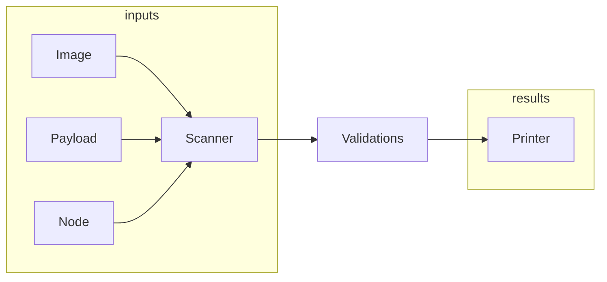

# check-payload


## About

This application scans container images in an OpenShift release payload, RHEL based nodes, or an operator image for FIPS enabled binaries. The goal is to ensure binaries are compiled correctly for OpenShift.

## Build

```sh
git clone https://github.com/openshift/check-payload.git
cd check-payload
make
```

## Run

### Prerequisites

* podman should be installed on the node.
* podman should be configured with pull secrets for the images to be scanned.

### Configuration

The binary has a number of built-in configuration files.

A default built-in configuration ([config.toml](./config.toml)) is used if no
options are specified, and no `./config.toml` file is available from the
current working directory when running the tool.

A specific configuration from a file can be specified using
`--config path/to/config.toml` option. Use `--config /dev/null` to use an empty
configuration.

An additional built-in coniguration tailored for a specific OpenShift version
can be specified using `-V`, `--config-for-version` option, for example `-V
4.11`. When this option is specified, the settings from the additional
configuration are added to (rather than override) the main configuration (see
above). These additional for-version configurations are embedded into the
binary during build time from the directories under
[dist/releases/](./dist/releases/).

### Scan an OpenShift release payload

```sh
 sudo ./check-payload scan payload -V 4.11 \
   --url quay.io/openshift-release-dev/ocp-release:4.11.44-x86_64 \
   --output-file report.txt
```

Here
* `-V` specifies the configuration for a particular OpenShift version;
* `--url` specifies a payload URL;
* `--output-file` specifies a file to write the scan report to.

### Scan a Local Unpacked Image Bundle

The `scan local` subcommand allows you to scan a local unpacked image bundle for FIPS compliance. This is particularly useful for testing or analyzing local images that have been unpacked using tools like `umoci`.

#### Usage

To scan a local unpacked image bundle, use the following command:

```sh
./check-payload scan local --path /path/to/local/bundle
```

Here:
* `--path` specifies the path to the local unpacked image bundle.

#### Example

```sh
./check-payload scan local --path ./test/resources/mock_unpacked_dir-1
```

This command will scan the local image bundle located in `./test/resources/mock_unpacked_dir-1`.

#### Use Case

This feature is useful for verifying FIPS compliance of container images in a local development environment,
without requiring access to `podman mount` which is blocked in some pipeline build systems.

### Scan a container or operator image

```sh
sudo ./check-payload scan operator \
  --spec registry.ci.openshift.org/ocp-priv/4.11-art-assembly-art6883-3-priv@sha256:138b1b9ae11b0d3b5faafacd1b469ec8c20a234b387ae33cf007441fa5c5d567
```

### Scan a node using container image

```sh
IMAGE=some.registry.location/check-payload
podman run --privileged -ti -v /:/myroot $IMAGE scan node --root /myroot
```

## How it works

`check-payload` gathers container images from OpenShift release payloads or
container images. The scanner can also be used on a RHEL or RHCOS node to scan the
root image. A node scan runs within a container with the host OS mounted within
it.

### Container Image and Payload Scans

Container Image and Payload Scans gather images and emit file paths to the
validation logic. This is done by `podman` mounting the image to the local
machine, walking the directory tree, and emitting the paths for executables to
the validation engine.

### Node Scans

RHEL or RHCOS nodes can be scanned with `check-payload scan node`. To gather the
file input paths the scanner queries for all the RPMs on the system and walks
the paths within the RPMs finding executables. The list of executable paths are
then processed by the validation engine.

### Diagram



### Validations

The validation engine uses different logic to validate golang and non-golang executables. The scanner only scans for ELF executables.

#### All

All scans validate the inclusion of OpenSSL via libcrypto found in `/usr/lib64`
or `/usr/lib`. The OpenSSL library is also validated to include `{FIPS_mode,
fips_mode, or EVP_default_properties_is_fips_enabled}`.

#### Regular Executables

The rules to scan regular executables are:

1. Must be dynamically linked

Most of RHEL/RHCOS executables are built dynamically to allow for dynamic
linking to OpenSSL. There are exceptions for rule (1) which consists of some
binaries (ldconfig, build-locale-archive, etc) which are required to be built
statically, and/or do not provide cryptographic functionality.

#### Golang Executables

Golang validations run through a pipeline:

1. validateGoVersion - enumerates the golang version and compile details
1. validateGoCgo - ensure CGO_ENABLED=1 is set
1. validateGoCGOInit - ensure cgo_init is within the binary
1. validateGoStatic - ensure binary is dynamically linked
1. validateGoOpenssl - ensure openssl matches the dynamic library within the system
1. validateGoTags - ensure golang tags are set

#### Java Development Kit

JDK validations run through a pipeline:

1. validateFipsHost - ensures the `check-payload` tool is being run on a FIPS enabled host
1. validateSystemProperties - ensures pertinent [FIPS property values](https://access.redhat.com/documentation/en-us/openjdk/8/html/configuring_openjdk_8_on_rhel_with_fips/config-fips-in-openjdk) are not being set at runtime
1. validateAlgorithms - ensures unacceptable algorithms and protocols are disabled at runtime

### Printer

The printer aggregates all the results and formats into a table, csv, markdown, etc. If any errors are found then the process exits non-zero. A successful run returns 0.
