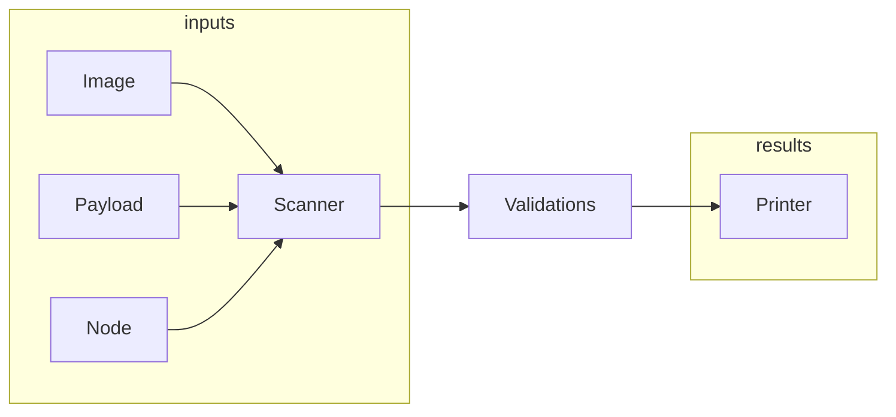

# check-payload

## About

This application scans container images in an OpenShift release payload, RHEL based nodes, or an operator image for FIPS enabled binaries. The goal is to ensure binaries are compiled correctly for OpenShift.

## Build

```sh
git clone https://github.com/openshift/check-payload.git
cd check-payload
make
```

## Run

### Prerequisites

* podman should be installed on the node.
* podman should be configured with pull secrets for the images to be scanned.

### Scan an OpenShift release payload

```sh
 sudo ./check-payload scan payload \
   --url quay.io/openshift-release-dev/ocp-release:4.11.0-assembly.art6883.4 \
   --output-file report.txt
```

### Scan a container or operator image

```sh
sudo ./check-payload scan operator \
  --spec registry.ci.openshift.org/ocp-priv/4.11-art-assembly-art6883-3-priv@sha256:138b1b9ae11b0d3b5faafacd1b469ec8c20a234b387ae33cf007441fa5c5d567
```

### Scan a node

```sh
IMAGE=some.registry.location/check-payload
podman  run --privileged -ti -v /:/myroot $IMAGE scan node --root /myroot
```

## How it works

`check-payload` gathers container images from OpenShift release payloads or
container images. The scanner can be used on a RHEL or RHCOS node to scan the
root image. A node scan runs within a container with the host OS mounted within
it.

### Container Image and Payload Scans

Container Image and Payload Scans gather images and emit file paths to the
validation logic. This is done by `podman` mounting the image to the local
machine, walking the directory tree, and emitting the paths for executables to
the validation engine.

### Node Scans

RHEL or RHCOS nodes can be scanned with `check-payload scan node`. To gather the
file input paths the scanner queries for all the RPMs on the system and walks
the paths within the RPMs finding executables. The list of executable paths are
then processed by the validation engine.

### Diagram



### Validations

The validation engine scans executables and golang executables independently. The scanner only scans for ELF executables.

#### All

All scans validate the inclusion of OpenSSL via libcrypto found in `/usr/lib64`
or `/usr/lib`. The OpenSSL library is also validated to include `{FIPS_mode,
fips_mode, or EVP_default_properties_is_fips_enabled}`.

#### Regular Executables

The rules to scan regular executables are:

1. Must be dynamically link

Most of RHEL/RHCOS executables are built dynamically to allow for dynamic
linking to OpenSSL. There are exceptions for rule (1) which consists of some
binaries (ldconfig, build-locale-archive, etc) which are required to be built
statically, and/or do not provide cryptographic functionality.

#### Golang

Golang validations run through a pipeline:

1. validateGoVersion
   * Runs `go version -m` on the binary to cache the golang compiler version and details from the compile
2. validateGoCgo
   * Golang <= 1.17 skips
   * validates the binary contains CGO_ENABLED=1 within the detailed output from validateGoVersion
3. validateGoCGOInit
   * Reads the binary and makes sure `cgo_init` is contained within (captures `x_cgo_init` as well)
4. validateGoSymbols
   * reads the golang symbol table
   * If zero crypto symbols are found then skips
   * Golang < 1.18 skips
   * validates expected cryptographic symbols:
     * `vendor/github.com/golang-fips/openssl-fips/openssl._Cfunc__goboringcrypto_DLOPEN_OPENSSL`
     * `crypto/internal/boring._Cfunc__goboringcrypto_DLOPEN_OPENSSL`
5. validateGoStatic
   * If zero crypto symbols are found then skips
   * If executable is static then error
6. validateGoOpenssl
   * If zero crypto symbols are found then skips
   * Scan the binary for the embedded libcrypto.so library
   * Ensure the image contains the correct libcrypto.so.N library within the container image
7. validateGoTags
   * Golang <= 1.17 skips
   * Ensure no_openssl is _not_ set

### Printer

The printer aggregates all the results and formats into a table, csv, markdown, etc. If any errors are found then the process exits non-zero. A successful run returns 0.
